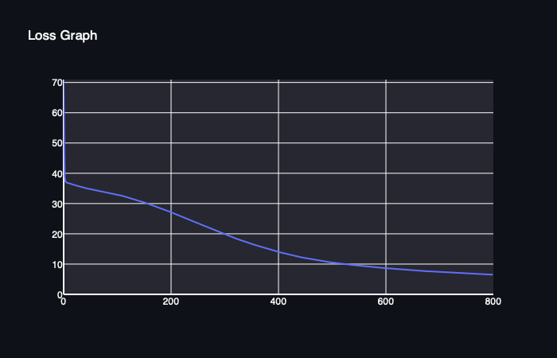

[](https://classroom.github.com/a/YFgwt0yY)
# MiniTorch Module 2


* Docs: https://minitorch.github.io/

* Overview: https://minitorch.github.io/module2/module2/

This assignment requires the following files from the previous assignments. You can get these by running

```bash
python sync_previous_module.py previous-module-dir current-module-dir
```

The files that will be synced are:

        minitorch/operators.py minitorch/module.py minitorch/autodiff.py minitorch/scalar.py minitorch/scalar_functions.py minitorch/module.py project/run_manual.py project/run_scalar.py project/datasets.py


## Task 2.5

### Task 2.5.1 Simple
```
PTS: 60
Hidden: 2
Rate: 0.1
Epochs: 600
Time per epoch: 0.123s
```

Train Logs:
```
Epoch: 0/500, loss: 0, correct: 0
Epoch: 10/500, loss: 40.84525469385332, correct: 34
Epoch: 20/500, loss: 39.785824647987404, correct: 34
Epoch: 30/500, loss: 39.01803759341362, correct: 34
Epoch: 40/500, loss: 38.227625841902565, correct: 34
Epoch: 50/500, loss: 37.31648898174694, correct: 34
Epoch: 60/500, loss: 36.233187979749005, correct: 34
Epoch: 70/500, loss: 35.01889088614266, correct: 42
Epoch: 80/500, loss: 33.59756922446151, correct: 43
Epoch: 90/500, loss: 31.940342917206916, correct: 43
Epoch: 100/500, loss: 30.087266326347002, correct: 50
Epoch: 110/500, loss: 27.991652576049322, correct: 54
Epoch: 120/500, loss: 25.80277899871501, correct: 55
Epoch: 130/500, loss: 23.692385465700543, correct: 55
Epoch: 140/500, loss: 21.649296441550465, correct: 56
Epoch: 150/500, loss: 19.683762507399987, correct: 57
Epoch: 160/500, loss: 17.8336364055276, correct: 58
Epoch: 170/500, loss: 16.157234095452306, correct: 58
Epoch: 180/500, loss: 14.637201392789, correct: 58
Epoch: 190/500, loss: 13.289860854795023, correct: 58
Epoch: 200/500, loss: 12.13904153908809, correct: 58
Epoch: 210/500, loss: 11.13289582886772, correct: 58
Epoch: 220/500, loss: 10.25993093971247, correct: 58
Epoch: 230/500, loss: 9.509101052074374, correct: 59
Epoch: 240/500, loss: 8.845787994642794, correct: 59
Epoch: 250/500, loss: 8.267651958659139, correct: 59
Epoch: 260/500, loss: 7.756216866554581, correct: 59
Epoch: 270/500, loss: 7.300697255413305, correct: 59
Epoch: 280/500, loss: 6.893121811386656, correct: 59
Epoch: 290/500, loss: 6.528589904774059, correct: 59
Epoch: 300/500, loss: 6.1979135402898216, correct: 59
Epoch: 310/500, loss: 5.898686255416561, correct: 59
Epoch: 320/500, loss: 5.62689747301578, correct: 59
Epoch: 330/500, loss: 5.3794012852937065, correct: 59
Epoch: 340/500, loss: 5.1534222551809075, correct: 59
Epoch: 350/500, loss: 4.945558066470218, correct: 60
Epoch: 360/500, loss: 4.754366133451118, correct: 60
Epoch: 370/500, loss: 4.57816953534772, correct: 60
Epoch: 380/500, loss: 4.415345968413594, correct: 60
Epoch: 390/500, loss: 4.264003684376274, correct: 60
Epoch: 400/500, loss: 4.123322186421813, correct: 60
Epoch: 410/500, loss: 3.992630501947684, correct: 60
Epoch: 420/500, loss: 3.8701361697350927, correct: 60
Epoch: 430/500, loss: 3.755533950950215, correct: 60
Epoch: 440/500, loss: 3.64813573879667, correct: 60
Epoch: 450/500, loss: 3.5473370906255766, correct: 60
Epoch: 460/500, loss: 3.452256217690041, correct: 60
Epoch: 470/500, loss: 3.362600075321354, correct: 60
Epoch: 480/500, loss: 3.278114961896648, correct: 60
Epoch: 490/500, loss: 3.198568492498644, correct: 60
Epoch: 500/500, loss: 3.1235486908755017, correct: 60
```

Image:


Loss Graph:


### Task 2.5.2 Diag
```
PTS: 60
Hidden: 2
Rate: 0.5
Epochs: 600
Time per epoch: 0.105s
```

Train Logs:
```
Epoch: 0/600, loss: 0, correct: 0
Epoch: 10/600, loss: 16.818027474030895, correct: 54
Epoch: 20/600, loss: 15.19238981524018, correct: 54
Epoch: 30/600, loss: 13.184699187112795, correct: 54
Epoch: 40/600, loss: 10.627456038858591, correct: 54
Epoch: 50/600, loss: 8.376223902766919, correct: 54
Epoch: 60/600, loss: 6.620845626924618, correct: 57
Epoch: 70/600, loss: 5.521977172033718, correct: 58
Epoch: 80/600, loss: 4.707504381564686, correct: 58
Epoch: 90/600, loss: 4.089416430883424, correct: 58
Epoch: 100/600, loss: 3.614588039734676, correct: 59
Epoch: 110/600, loss: 3.2418589093811505, correct: 59
Epoch: 120/600, loss: 2.942157083054044, correct: 59
Epoch: 130/600, loss: 2.6954783798685096, correct: 60
Epoch: 140/600, loss: 2.4881082398972394, correct: 60
Epoch: 150/600, loss: 2.3105008571213106, correct: 60
Epoch: 160/600, loss: 2.1560139479918634, correct: 60
Epoch: 170/600, loss: 2.019888531004187, correct: 60
Epoch: 180/600, loss: 1.8986345761642225, correct: 60
Epoch: 190/600, loss: 1.789671039065151, correct: 60
Epoch: 200/600, loss: 1.6910184502569698, correct: 60
Epoch: 210/600, loss: 1.6011354556258695, correct: 60
Epoch: 220/600, loss: 1.5188058746692694, correct: 60
Epoch: 230/600, loss: 1.4430503878912044, correct: 60
Epoch: 240/600, loss: 1.3730727717606126, correct: 60
Epoch: 250/600, loss: 1.3082109462296243, correct: 60
Epoch: 260/600, loss: 1.248497965496012, correct: 60
Epoch: 270/600, loss: 1.1936020214686125, correct: 60
Epoch: 280/600, loss: 1.1423796009745648, correct: 60
Epoch: 290/600, loss: 1.094295356520913, correct: 60
Epoch: 300/600, loss: 1.0490703217649242, correct: 60
Epoch: 310/600, loss: 1.0064652338256548, correct: 60
Epoch: 320/600, loss: 0.9662745877398032, correct: 60
Epoch: 330/600, loss: 0.9283180964566999, correct: 60
Epoch: 340/600, loss: 0.8924355075928757, correct: 60
Epoch: 350/600, loss: 0.8584830603895185, correct: 60
Epoch: 360/600, loss: 0.8263308002563343, correct: 60
Epoch: 370/600, loss: 0.7958605047728934, correct: 60
Epoch: 380/600, loss: 0.7669640551184079, correct: 60
Epoch: 390/600, loss: 0.7396956954902533, correct: 60
Epoch: 400/600, loss: 0.7138550724752942, correct: 60
Epoch: 410/600, loss: 0.6892908233968317, correct: 60
Epoch: 420/600, loss: 0.6659253250704006, correct: 60
Epoch: 430/600, loss: 0.6436874493360288, correct: 60
Epoch: 440/600, loss: 0.6225113380729399, correct: 60
Epoch: 450/600, loss: 0.6023355783463638, correct: 60
Epoch: 460/600, loss: 0.5831030420354246, correct: 60
Epoch: 470/600, loss: 0.564759959365983, correct: 60
Epoch: 480/600, loss: 0.5472560533140268, correct: 60
Epoch: 490/600, loss: 0.5305444107835855, correct: 60
Epoch: 500/600, loss: 0.5145810822903861, correct: 60
Epoch: 510/600, loss: 0.49932487379033036, correct: 60
Epoch: 520/600, loss: 0.4847371564078351, correct: 60
Epoch: 530/600, loss: 0.4707816917167243, correct: 60
Epoch: 540/600, loss: 0.4574244707100773, correct: 60
Epoch: 550/600, loss: 0.4446335649536013, correct: 60
Epoch: 560/600, loss: 0.43237898868585795, correct: 60
Epoch: 570/600, loss: 0.42063268950626886, correct: 60
Epoch: 580/600, loss: 0.4093680625546568, correct: 60
Epoch: 590/600, loss: 0.39856019588862707, correct: 60
Epoch: 600/600, loss: 0.38818568853672214, correct: 60
```

Image:


Loss Graph:


### Task 2.5.3 Split
```
PTS: 60
Hidden: 8
Rate: 0.1
Epochs: 800
Time per epoch: 0.519s
```

Train Logs:
```
Epoch: 0/800, loss: 0, correct: 0
Epoch: 10/800, loss: 36.780034894066326, correct: 41
Epoch: 20/800, loss: 36.21491374887613, correct: 41
Epoch: 30/800, loss: 35.624786142022856, correct: 41
Epoch: 40/800, loss: 35.121948286437444, correct: 41
Epoch: 50/800, loss: 34.796343468854865, correct: 41
Epoch: 60/800, loss: 34.45809165232739, correct: 41
Epoch: 70/800, loss: 34.112677291827154, correct: 41
Epoch: 80/800, loss: 33.78073584121442, correct: 41
Epoch: 90/800, loss: 33.44237081500102, correct: 41
Epoch: 100/800, loss: 33.02543148958945, correct: 41
Epoch: 110/800, loss: 32.5566953448648, correct: 41
Epoch: 120/800, loss: 32.06370493005178, correct: 41
Epoch: 130/800, loss: 31.538727222043732, correct: 41
Epoch: 140/800, loss: 30.990584213402556, correct: 42
Epoch: 150/800, loss: 30.421645381722506, correct: 43
Epoch: 160/800, loss: 29.82239181821631, correct: 44
Epoch: 170/800, loss: 29.200006868593505, correct: 44
Epoch: 180/800, loss: 28.550882397824754, correct: 45
Epoch: 190/800, loss: 27.881525719393238, correct: 48
Epoch: 200/800, loss: 27.193396941139728, correct: 48
Epoch: 210/800, loss: 26.493307731283085, correct: 49
Epoch: 220/800, loss: 25.779759822322873, correct: 51
Epoch: 230/800, loss: 25.053616111828923, correct: 52
Epoch: 240/800, loss: 24.317351024331018, correct: 52
Epoch: 250/800, loss: 23.57117069428643, correct: 52
Epoch: 260/800, loss: 22.816632913797477, correct: 52
Epoch: 270/800, loss: 22.05294227477699, correct: 52
Epoch: 280/800, loss: 21.29380495485053, correct: 53
Epoch: 290/800, loss: 20.578310833867114, correct: 53
Epoch: 300/800, loss: 19.895208295428876, correct: 54
Epoch: 310/800, loss: 19.221505223371633, correct: 54
Epoch: 320/800, loss: 18.561937751739706, correct: 54
Epoch: 330/800, loss: 17.91642391574161, correct: 54
Epoch: 340/800, loss: 17.29858827937823, correct: 55
Epoch: 350/800, loss: 16.718672410273694, correct: 55
Epoch: 360/800, loss: 16.1566835492861, correct: 56
Epoch: 370/800, loss: 15.610920279398847, correct: 56
Epoch: 380/800, loss: 15.083280133714528, correct: 56
Epoch: 390/800, loss: 14.574004283090536, correct: 56
Epoch: 400/800, loss: 14.083231325674866, correct: 56
Epoch: 410/800, loss: 13.611453623724604, correct: 56
Epoch: 420/800, loss: 13.15915971018939, correct: 57
Epoch: 430/800, loss: 12.728940959589739, correct: 57
Epoch: 440/800, loss: 12.353202803026335, correct: 57
Epoch: 450/800, loss: 12.001082688654158, correct: 57
Epoch: 460/800, loss: 11.66924193969231, correct: 57
Epoch: 470/800, loss: 11.354851535493298, correct: 57
Epoch: 480/800, loss: 11.059272619269828, correct: 57
Epoch: 490/800, loss: 10.789206091625141, correct: 57
Epoch: 500/800, loss: 10.537994478162886, correct: 57
Epoch: 510/800, loss: 10.306928930931848, correct: 57
Epoch: 520/800, loss: 10.090780371508652, correct: 58
Epoch: 530/800, loss: 9.88578309759209, correct: 58
Epoch: 540/800, loss: 9.689247343101414, correct: 58
Epoch: 550/800, loss: 9.500656710257832, correct: 58
Epoch: 560/800, loss: 9.319182209799807, correct: 58
Epoch: 570/800, loss: 9.144392515198154, correct: 58
Epoch: 580/800, loss: 8.975924247725533, correct: 58
Epoch: 590/800, loss: 8.81347035527483, correct: 58
Epoch: 600/800, loss: 8.656745415428034, correct: 58
Epoch: 610/800, loss: 8.508489296136052, correct: 58
Epoch: 620/800, loss: 8.366911770795637, correct: 58
Epoch: 630/800, loss: 8.230083106742876, correct: 58
Epoch: 640/800, loss: 8.097715231717961, correct: 58
Epoch: 650/800, loss: 7.969599061019615, correct: 58
Epoch: 660/800, loss: 7.846003555957095, correct: 59
Epoch: 670/800, loss: 7.728359411809082, correct: 58
Epoch: 680/800, loss: 7.6147370545651425, correct: 58
Epoch: 690/800, loss: 7.50563627840399, correct: 58
Epoch: 700/800, loss: 7.400486018166534, correct: 59
Epoch: 710/800, loss: 7.298661279971298, correct: 59
Epoch: 720/800, loss: 7.2000705676037935, correct: 59
Epoch: 730/800, loss: 7.104112014570782, correct: 59
Epoch: 740/800, loss: 7.010663157404579, correct: 59
Epoch: 750/800, loss: 6.919615951669412, correct: 59
Epoch: 760/800, loss: 6.830868878704295, correct: 59
Epoch: 770/800, loss: 6.744429945806204, correct: 59
Epoch: 780/800, loss: 6.660158876608094, correct: 59
Epoch: 790/800, loss: 6.577912289548147, correct: 59
Epoch: 800/800, loss: 6.49759774010848, correct: 59
```

Image:


Loss Graph:



### Task 2.5.4 Xor
```
PTS: 50
Hidden: 16
Rate: 0.5
Epochs: 800
Time per epoch: 1.393s
```

Train Logs:
```
Epoch: 0/300, loss: 0, correct: 0
Epoch: 10/250, loss: 28.539728606775938, correct: 36
Epoch: 20/250, loss: 27.481903059088673, correct: 35
Epoch: 30/250, loss: 25.404934915218178, correct: 37
Epoch: 40/250, loss: 21.509799179990132, correct: 41
Epoch: 50/250, loss: 17.945748205194718, correct: 41
Epoch: 60/250, loss: 15.67982350973796, correct: 41
Epoch: 70/250, loss: 12.116719802091435, correct: 47
Epoch: 80/250, loss: 9.93662564957105, correct: 48
Epoch: 90/250, loss: 8.097089268456049, correct: 48
Epoch: 100/250, loss: 6.4927316241802595, correct: 48
Epoch: 110/250, loss: 5.608956306516631, correct: 49
Epoch: 120/250, loss: 4.680248402040778, correct: 50
Epoch: 130/250, loss: 3.972240380116551, correct: 50
Epoch: 140/250, loss: 3.3779562012670605, correct: 50
Epoch: 150/250, loss: 2.9149757366223996, correct: 50
Epoch: 160/250, loss: 2.5747428466294044, correct: 50
Epoch: 170/250, loss: 2.3061976723823006, correct: 50
Epoch: 180/250, loss: 2.0581979515478497, correct: 50
Epoch: 190/250, loss: 1.8614543360861548, correct: 50
Epoch: 200/250, loss: 1.6983156238819694, correct: 50
Epoch: 210/250, loss: 1.555987633277961, correct: 50
Epoch: 220/250, loss: 1.431384543572117, correct: 50
Epoch: 230/250, loss: 1.322777058422166, correct: 50
Epoch: 240/250, loss: 1.2140738258377906, correct: 50
Epoch: 250/250, loss: 1.1474103368163706, correct: 50
```

Image:


Loss Graph:

